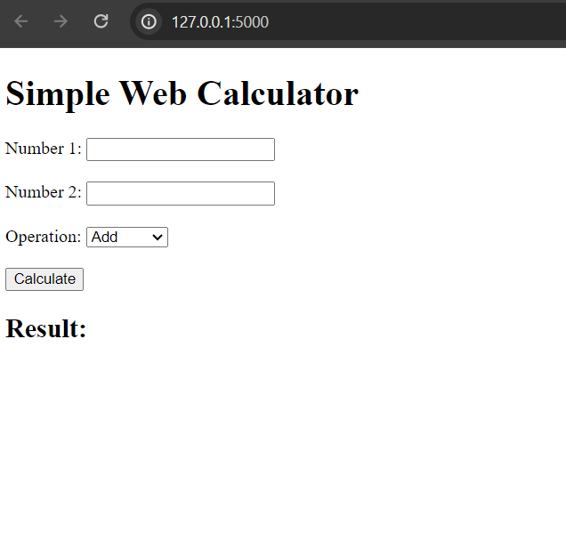

# Calculator Project



## Project Overview
The Calculator Project is a simple, yet functional browser-based program implemented in Python using the Flask library. It provides basic arithmetic operations such as addition, subtraction, multiplication, and division. The goal of this project is to serve as a foundation for further enhancements or integration into larger systems.

### Features
- Perform basic arithmetic operations:
- Supports both integer and floating-point numbers.
- User-friendly interface.

## Installation

1. Clone the repository:
```
git clone https://github.com/martynagotfryd/Calculatorr.git
cd Calculatorr
```
2. Install dependencies:
```
pip install -r requirements.txt
```

## Usage

1. Run the Python script:
```
python app.py
```
2. Open a web browser and navigate to http://localhost:5000 to use calculator.
3. Follow the on-screen instructions to performe avalible calculations.

## Testing
To run unit tests:
```
pytest
```

## Technologies Used:

1. **Flask (Python)**:
   - A micro web framework for Python, used to handle HTTP requests and serve web content.
   - Flask manages the backend logic and routing of the web calculator.

2. **PyMongo**:
   - A Python library that enables interaction with **MongoDB**, used to store calculation data.
   - MongoDB stores previous calculations, operations, and results in a document-based format.

3. **MongoDB**:
   - A NoSQL database that stores calculation data in JSON-like documents, enabling easy access to past results.

4. **HTML & Jinja2**:
   - **HTML** is used to structure the front-end web interface of the calculator.
   - **Jinja2**, a templating engine for Python (used with Flask), renders dynamic content on the web pages.

5. **JavaScript (Node.js)** (Optional):
   - Although the `package.json` file is present, its use in the project is minimal or optional. JavaScript may be used for front-end interactions or additional functionality.

6. **Docker**:
   - **Docker** is used to containerize the application, allowing it to run in an isolated environment. Both `Dockerfile` and `docker-compose.yml` are provided to ensure smooth deployment.

7. **Testing**:
   - **Pytest** is used for unit testing various components of the calculator to ensure the correctness of calculations and business logic.


